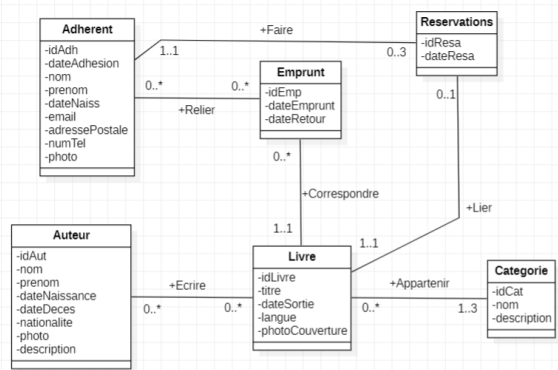
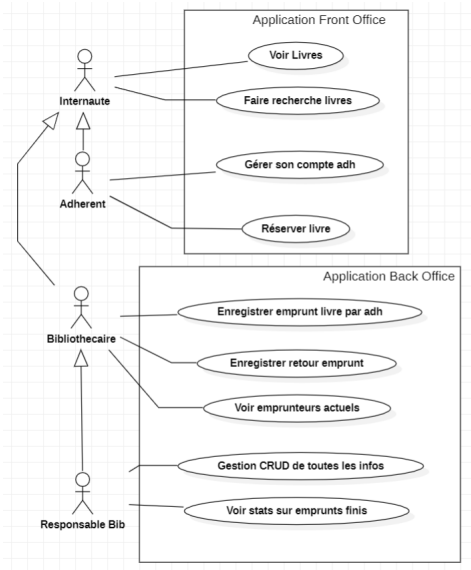

# SAE Développement Avancé 

Thomas Demeyere, Julien Druelle, Adriel Marchant, Hai Son Dang, Matéo Pepin | BUT3 G2

## Gestionnaire de Bibliothèque

L'objectif de ce projet est le développement d'une application web de gestion d'une bibliothèque.  
Elle est divisée en 2 parties : Un back office pour les personnes qui gèrent la bibliothèque et un front office pour les personnes voulant utiliser les services proposés par la bibliothèque.

### Diagramme de Classes

### Diagramme des Cas d'Utilisation

